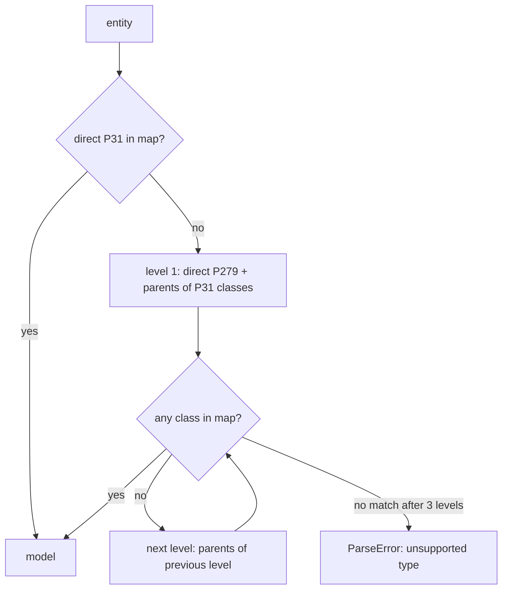

Wikidata
========

`catalog.sites.wikidata.WikiData` imports catalog items from [Wikidata](https://www.wikidata.org/).
It fetches an entity from the Wikibase REST v1 API, decides which NeoDB model the entity is,
extracts metadata for that model, and collects external identifiers for deduplication.
This page explains how the type decision works and how to change it.

Type classification
-------------------

Wikidata does not have a fixed type system. An entity declares its types with
`instance of` (P31) statements, and each type class declares parents with
`subclass of` (P279) statements. NeoDB maps a small set of well-known class QIDs
to its own models in `WikiData.TYPE_TO_MODEL_MAP`.

The classification runs in two steps:

1. Match the entity's direct P31 values against the map. A priority type
   (see below) wins over statement order; otherwise the first mapped value wins.
2. If no direct value matches, walk up the subclass graph level by level,
   starting from the entity's direct P279 values and the parents of its P31
   classes. At each level, match all classes on that level against the map.
   The walk stops at the first level with a match, so the nearest mapped
   ancestor always wins. The walk gives up after three levels.

Notes on the walk:

- Each class lookup is one API call. Results go into a process-level cache,
  so repeated imports do not fetch the same class twice.
- A failed class lookup (deleted QID, rate limit, network error) skips that
  class. It never aborts the import.
- Deprecated-rank P31 statements are ignored, like all deprecated statements
  (see Statement ranks below).

Type-to-model map
-----------------

All QIDs and labels below are verified against the live Wikidata API.
The NeoDB category follows from the model.

| Wikidata class | Label | NeoDB model | Category |
|---|---|---|---|
| Q5 | human | People | people |
| Q4830453 | business | People | people |
| Q2085381 | publishing house | People | people |
| Q18127 | record label | People | people |
| Q1762059 | film production company | People | people |
| Q375336 | film studio | People | people |
| Q1107679 | animation studio | People | people |
| Q742421 | theatre company | People | people |
| Q210167 | video game developer | People | people |
| Q1137109 | video game publisher | People | people |
| Q11424 | film | Movie | movie |
| Q20650540 | anime film | Movie | movie |
| Q202866 | animated film | Movie | movie |
| Q226730 | silent film | Movie | movie |
| Q506240 | television film | Movie | movie |
| Q24862 | short film | Movie | movie |
| Q18011172 | film project | Movie | movie |
| Q220898 | original video animation | Movie | movie |
| Q1261214 | television special | Movie | movie |
| Q5398426 | television series | TVShow | tv |
| Q15416 | television program | TVShow | tv |
| Q1259759 | miniseries | TVShow | tv |
| Q63952888 | anime television series | TVShow | tv |
| Q11086742 | anime television program | TVShow | tv |
| Q581714 | animated series | TVShow | tv |
| Q117467246 | animated television series | TVShow | tv |
| Q113687694 | original video animation series | TVShow | tv |
| Q113671041 | original net animation series | TVShow | tv |
| Q3464665 | television series season | TVSeason | tv |
| Q21191270 | television series episode | TVEpisode | tv |
| Q11410 | game | Game | game |
| Q7889 | video game | Game | game |
| Q865493 | video game mod | Game | game |
| Q209163 | expansion add-on | Game | game |
| Q107466928 | expansion pack | Game | game |
| Q1066707 | downloadable content | Game | game |
| Q131436 | board game | Game | game |
| Q3244175 | tabletop game | Game | game |
| Q1196126 | video game console emulator | Game | game |
| Q482994 | album | Album | music |
| Q134556 | single | Album | music |
| Q169930 | extended play | Album | music |
| Q10590726 | video album | Album | music |
| Q108346082 | release group | Album | music |
| Q2031291 | musical release | Album | music |
| Q24634210 | podcast show | Podcast | podcast |
| Q61855877 | podcast episode | PodcastEpisode | podcast |
| Q25379 | play | Performance | performance |
| Q2743 | musical play | Performance | performance |
| Q1344 | opera | Performance | performance |
| Q43099500 | performing arts production | Performance | performance |
| Q116476516 | dramatic work | Performance | performance |
| Q7725634 | literary work | Work | book |
| Q8261 | novel | Work | book |
| Q571 | book | Work | book |
| Q47461344 | written work | Work | book |
| Q21198342 | manga series | Work | book |
| Q196600 | media franchise | Work | book |
| Q17537576 | creative work | Work | book |
| Q3331189 | version, edition or translation | Edition | book |

Q108346082 (release group) and Q2031291 (musical release) are umbrella
classes: their subclasses (mini album, single album, demo, album release, and
the other release-level classes) classify as Album through the subclass walk.
Album subtypes such as live album or compilation album subclass Q482994 and
are covered the same way. In practice most albums carry plain Q482994 as P31,
whatever their subtype.

Priority types
--------------

`WikiData.PRIORITY_TYPES` lists classes that win over all other mapped classes
when an entity has several types. There is one entry: Q1261214 (television
special). An entity that is both a television episode and a television special
becomes a Movie, not a TVEpisode.

Ambiguous ancestor classes
--------------------------

`WikiData.AMBIGUOUS_ANCESTOR_TYPES` lists classes that are too generic to
identify a category from the subclass graph. There is one entry: Q17537576
(creative work). Almost every creative type on Wikidata is a descendant of it,
so matching it during the walk would turn any unmapped type into a book. The
walk therefore never matches it. A direct `instance of` creative work statement
still maps to Work, because the editor of that entity chose the class
deliberately.

An entity whose types resolve only to ambiguous or unmapped classes raises
`ParseError` with the unsupported type list. This is intentional: a clear
failure is better than an item in the wrong category.

Statement ranks
---------------

Wikidata statements carry a rank. `_normalize_entity` applies the standard
best-rank rule to every property before extraction: deprecated statements are
dropped, and when a property has preferred statements, only those are kept.
Statements without a value (`novalue`, `somevalue`) are also dropped. This
applies to classification (P31) and to all metadata and external identifiers.

How to add a new type mapping
-----------------------------

1. Find the class QID. Verify its English label against the live Wikidata API;
   do not trust memory or third-party lists. Check that real entities use it as
   a P31 value, for example with the query `haswbstatement:P31=Q...` in the
   Wikidata search box.
2. Add a constant to `WikidataTypes` with the verified label as comment.
3. Add the constant to `TYPE_TO_MODEL_MAP`. Prefer mapping the specific class
   over relying on the subclass walk; direct matches are faster and stable
   against edits to the Wikidata class graph.
4. If the model is new to this site, add an extractor method and register it
   in the dispatch table in `scrape()`.
5. Add a case to `test_basic_entity_type_detection` in
   `neodb/tests/catalog/test_wikidata.py`.

The verification step matters. Three organization QIDs in this map once pointed
at a moth species, a scorpion species, and a deleted entity, and nobody noticed
until the labels were checked against the live API.

Known limits
------------

- Q1107 (anime) has a constant but no mapping; it is too broad to pick a
  model.
- Compositions are not releases. Q7366 (song) and the musical-work classes
  stay unmapped because NeoDB has no Song model. An entity typed as both
  single and song classifies as Album through the single class.
- Q10590726 (video album) is also a subclass of film on Wikidata. A few dozen
  entities carry both P31 values; for those, the first mapped statement in
  payload order decides between Album and Movie.
- Radio series (Q14623351) and radio program (Q1555508) are deliberately
  unmapped. NeoDB has no radio category, and mapping them elsewhere would be a
  product decision. Importing one fails with the unsupported-type error.
- A merged (redirected) QID is imported under the requested QID; the canonical
  QID is only logged. Deduplication of both sides is a known follow-up.
